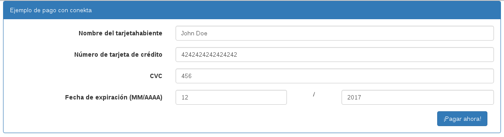

# Conekta-codeigniter
Implementación de conekta en CodeIgniter

# Requisitos
<ul>
<li>Implementado en CodeIgniter 3.0.0</li>
<li>Tener cuenta en http://www.conekta.io</li>
</ul>

# Instalación
<ul>
<li>Descargar esta implementación</li>
<li>Abrir el archivo ./application/config/config.php</li>
<li>
  Modificar la url que viene por defecto
  <pre>
    $config['base_url'] = 'http://localhost/Conekta-codeigniter/';
  </pre>
  Por:
  <pre>
    $config['base_url'] = 'http://dominio/proyecto/';
  </pre>
  O poner acorde al nombre descargado:
  <pre>
  	$config['base_url'] = 'http://localhost/Conekta-codeigniter-master/';
  </pre>

</li>
<li>Abrir el archivo ./application/config/conekta.php</li>
<li>
  Modificar las llaves pública y privada por defecto por las que te asignó conekta
  <pre>
    $config['conekta_api_key_private'] = 'key_private';
    $config['conekta_api_key_public'] = 'key_public';
  </pre>

</li>
<li>Al abrir el navegador y teclear la dirección de tu proyecto http://localhost/Conekta-codeigniter/ deberá mostrar la vista para capturar datos de la tarjeta de credito, solo presionar boton pagar ahora y mostrara el cargo generado en conekta.

</li>
<li>Controlador payment
<pre>
class Payment extends CI_Controller {

    public function __construct() {
        parent::__construct();
        //cargamos la libreria que usará a conekta, esta a su vez
        //carga el archivo config "conekta" que contiene las llaves
        //publica y privada
        $this->load->library("conekta/conekta_main");
    }

    public function index() {
        $this->load->view("payment_new");
    }

    public function create() {
        $response= array("status"=>0,"msg"=>"Ocurrio un error");
        if($this->input->is_ajax_request()){
            
            //obtener datos post
            $card= $this->input->post('card');
	   
            try {

               //creamos un cargo
                $charge_new = Conekta_Charge::create(array(
                    'description'=> 'Stogies',
                    'amount'=>20000,
                    'currency'=>'MXN',
                    'card'=> 'tok_test_visa_4242', //prueba, $this->input->post('token_id'),
                    'details'=> array(
                        'buyer'=> $card['name'],
                        'precio'=> 2000,
                        'cantidad'=> 1,
                        'email'=>'logan@x-men.org'
                    )
                ));
               
                if($charge_new->status =='paid'){
                    $response['status']=1;
                    $response['charge_id']= $charge_new->id;
                    $response['msg']="Pago existoso";
                }else{
                     $response['status']=0;
                }
                
            } catch (Conekta_Error $e) {
                $response['status']=0;
                $response['msg']= $e->getMessage();
            }
        }

        //Regresamos la info ...Cocinado!!
        $json = json_encode($response);
        echo isset($_GET['callback']) ? "{$_GET['callback']}($json)" : $json;
    }

    public function find($id) {

        //para buscar un cargo existente
        try {
             print_r_pre(Conekta_Charge::find($id));
        } catch (Conekta_Error $e) {
            echo $e->getMessage();
        }
    }

}

</pre>
</li>
</ul>

